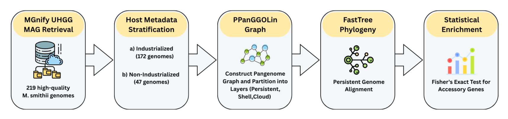
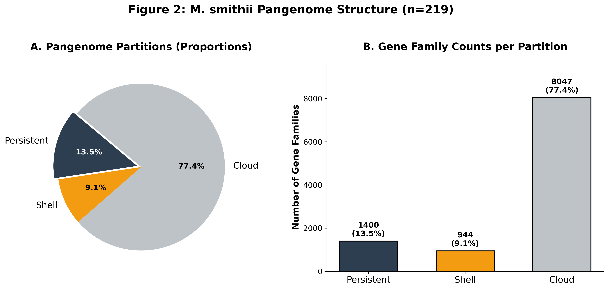
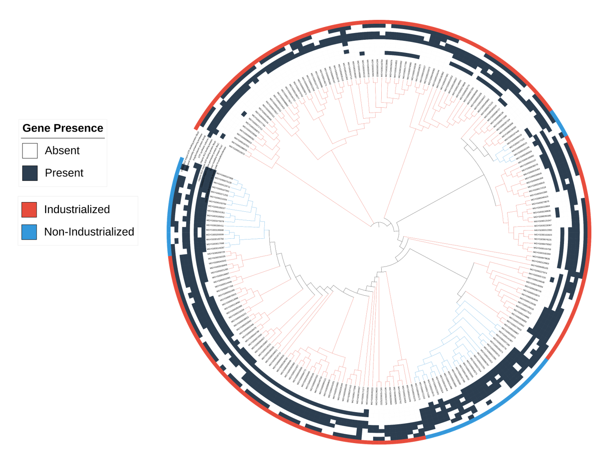
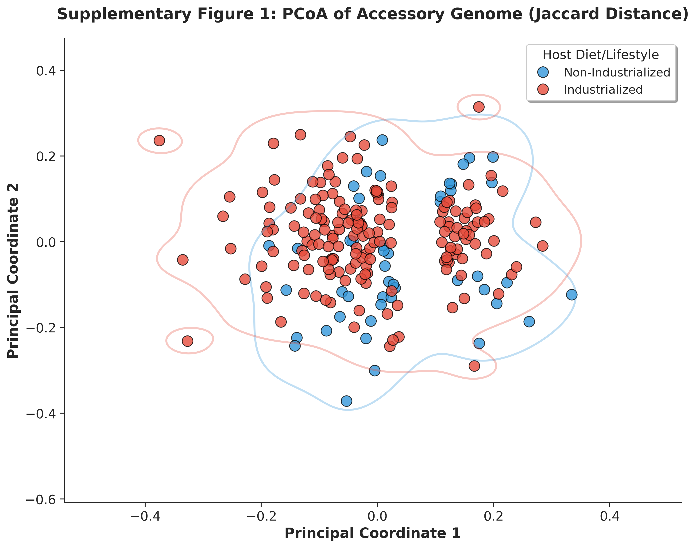
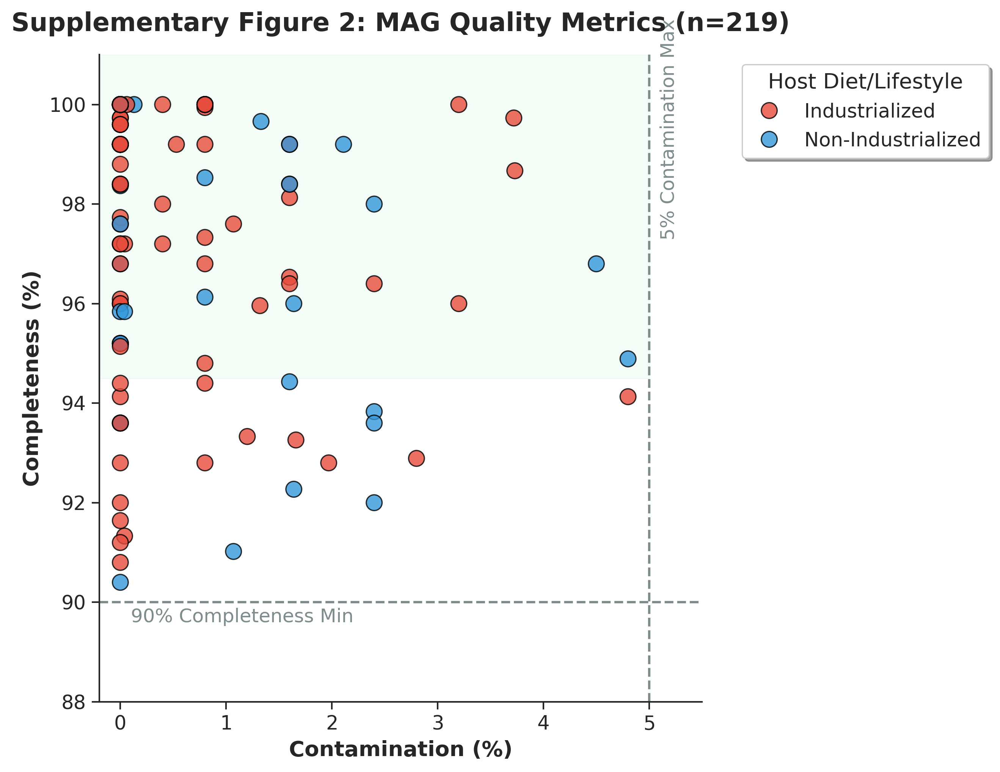

# Host Industrialization Drives Dietary-Dependent Structural Variation and Gene Shedding in the Human Gut Archaeon *Methanobrevibacter smithii*

[](https://docs.google.com/document/d/1rfBc7KQZMjUUAjXobXgQXsQ8ZP_RKd8d/edit)
[](https://colab.research.google.com/drive/1-ZKFKmX9j_sWk19xfGzZq70B_CoDLOGp?usp=drive_link)

This repository contains the code, datasets, and supplementary materials for the manuscript analyzing how host industrialization and diet influence the genomic structural variation and accessory genome of *Methanobrevibacter smithii*, the dominant archaeal keystone species in the human gut.

## Project Overview

While the bacterial fraction of the human gut microbiome has been exhaustively characterized, the archaeome remains critically understudied. Recent macro-ecological studies show that industrialization—characterized by increased sanitation, antibiotic use, and shifts toward Westernized diets—fundamentally alters gut microbiome composition. 

This project utilizes a pan-metagenomic approach across 219 high-quality *M. smithii* Metagenome-Assembled Genomes (MAGs) to identify specific, structurally conserved metabolic adaptations driven by host lifestyle. To isolate the effects of host industrialization, we compared an Industrialized cohort (US and UK; n=172) against a Non-Industrialized cohort (Peru, Fiji, Madagascar; n=47). Genomes from transitional economies or regions with distinct dietary patterns were excluded to prevent lifestyle admixture from attenuating statistical signals.

### Key Findings
Based on our comparative genomic analysis, we identified several major structural adaptations in *M. smithii* driven by host lifestyle:
* **Micronutrient Scavenging & Gene Shedding:** Western diets provide an overabundance of free amino acids and cobalamin (Vitamin B12) in the gut lumen. In this nutrient-rich environment, the energetic cost of maintaining endogenous high-affinity B12 pumps and Lysine synthetic factories outweighs their benefit, leading to evolutionary gene shedding in Industrialized strains. Conversely, traditional, non-industrialized diets create a gut environment where essential micronutrients are scarce, placing immense selective pressure on strains to retain genes necessary to scavenge sparse Vitamin B12 and synthesize essential amino acids.
* **Methanogenesis Optimization:** Industrialized strains exhibited an enrichment in specific methanogenesis and energy-yielding components, notably the polyferredoxin protein MvhB. Altered bacterial fermentation in industrialized diets likely shifts the stoichiometric availability of hydrogen gas, forcing Western *M. smithii* strains to optimize their electron bifurcation and methanogenic throughput to remain competitive.

---

## Key Figures

<p align="center">
  
</p>

**Figure 1: Bioinformatics Pipeline Workflow.** A flowchart of the methodology: (1) MGnify UHGG MAG Retrieval, (2) Host Metadata Stratification into Industrialized and Non-Industrialized cohorts, (3) PPanGGOLiN Graph Construction and partitioning, (4) FastTree Phylogeny based on the persistent genome, and (5) Statistical Enrichment using Fisher's Exact Test. 

<br>

<p align="center">
  
  
</p>

**Left — Figure 2: *M. smithii* Pangenome Structure (n=219).** A visualization showing the raw size and percentage of the pangenome partitions across the 219 strains. The persistent genome (highly conserved genetic core) constitutes only 13.5% (1,400 families) of the total genetic repertoire. The accessory genome is overwhelmingly dominant, split into a moderately conserved shell genome (9.1%, 944 families) and a massive cloud genome (77.4%, 8,047 families). This highly open pangenome structure highlights the organism's capacity for rapid, localized adaptation to distinct host gut environments.

**Right — Figure 3: Phylogenomic Analysis of the Persistent Genome.** This tree is annotated with lifestyle-specific accessory genes. The inner ring denotes host industrialization status (Red: Industrialized, Blue: Non-Industrialized). The outer heatmap illustrates the presence (dark) or absence (white) of key metabolic structural variations. The visualization demonstrates distinct evolutionary clustering driven by host lifestyle, showcasing a marked loss of Vitamin B12 scavenging (BtuC/D) and Lysine biosynthesis genes in industrialized clades.

---

## Supplementary Figures

<p align="center">
  
  
</p>

**Left — Supplementary Figure 1: PCoA of Accessory Genome.** A 2D scatter plot where each dot represents a genome (Red for Industrialized, Blue for Non-Industrialized). This analysis reveals two primary global structural clusters. Because these clusters are not strictly partitioned by host industrialization status, it suggests that the loss of specific metabolic pathways (like BtuC/D and Lysine biosynthesis) represents a highly targeted, convergent adaptation to the industrialized gut environment, rather than just ancient geographic divergence.

**Right — Supplementary Figure 2: MAG Quality Metrics.** A scatter plot displaying completeness versus contamination percentages for all 219 *M. smithii* MAGs utilized in the analysis. The dashed lines indicate the strict quality inclusion thresholds of >90% completeness and <5% contamination. The distribution demonstrates high-quality assemblies across both cohorts with no systematic bias in sequencing quality between the lifestyle groups.

---
## Code and Reproducibility

All primary bioinformatic and statistical analyses are documented within the `m-smithii-lifestyle-pangenome.ipynb` Jupyter Notebook. For ease of reproducibility, the analysis is configured to run interactively in Google Colab.

[](https://colab.research.google.com/drive/1-ZKFKmX9j_sWk19xfGzZq70B_CoDLOGp?usp=drive_link)

### Execution Instructions
* **Access the Code:** Open the notebook via the link above to access the full code and datasets directly within the Colab environment.
* **Environment Setup:** You do not need to pre-configure a local environment. The notebook automatically handles the installation of all required dependencies via `condacolab` upon execution.

## Tree Visualization (iTOL)

To reproduce the phylogenetic visualizations discussed in the paper:
1. Upload the FastTree output `sup/Galaxy26-[FASTTREE on dataset 25_tree.nhx].nhx` to the [Interactive Tree Of Life (iTOL)](https://itol.embl.de/).
2. Drag and drop the annotation files over the generated tree:
   * `sup/itol_color_strip.txt` (Adds metadata color strips defining the Industrialized vs. Non-Industrialized cohorts)
   * `sup/itol_heatmap.txt` (Adds the presence/absence heatmap for the identified structural lifestyle genes)

## Data Availability

All primary genomic metadata and filtering metrics are available in `sup/Supplementary_Table_1_MAG_Metrics.csv`. Specific annotated gene hits used to evaluate structural variation are located in `sup/Final_annotated_lifestyle_genes_filtered.csv`. You can read the full current draft of the manuscript [here](https://docs.google.com/document/d/1rfBc7KQZMjUUAjXobXgQXsQ8ZP_RKd8d/edit).


## Repository Structure

```text
.
├── Fig_1_v2.png                                # Workflow
├── Fig_2.png                                   # Pangenome Structure
├── Fig_3_v2.png                                # Phylogenic Tree
├── README.md                                   # Project documentation
├── .gitignore                                  # Git ignore file
└── sup/                                        # Supplementary files and data
    ├── Final_annotated_lifestyle_genes_filtered.csv # Annotated accessory genes linked to lifestyle
    ├── Galaxy26-[FASTTREE on dataset 25_tree.nhx].nhx # Phylogenetic tree output from FastTree
    ├── itol_color_strip.txt                    # iTOL annotation: Color strip for host lifestyle
    ├── itol_heatmap.txt                        # iTOL annotation: Heatmap of gene presence/absence
    ├── Supplementary_Table_1_MAG_Metrics.csv   # Quality metrics and metadata for all utilized MAGs
    ├── Supp_Fig_1_PCoA.png                     # Supplementary PCoA plot of genome structural variation
    └── Supp_Fig_2_MAG_Quality.png              # Supplementary plot of MAG completeness and contamination
```


